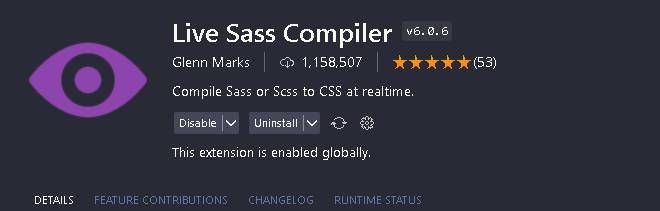

### Step 1

`npm install` or `yarn`

To start the project

### Step 2

Install this VSCODE extension to compile scss

And click In the bottom of VSCODE Watch Sass to generate css files

### Step 3

Use any extension that you wan't to run live server of the index file

# Don't change main.css file and bootstrap.bundle.min.js file
